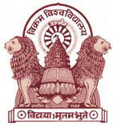
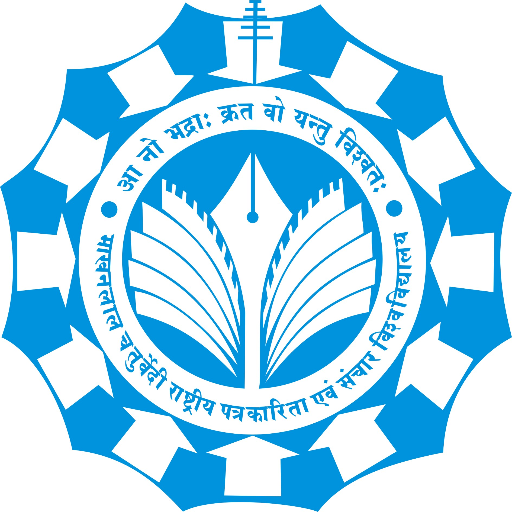

# Education

 

## IBM Data Science Professional Certificate

**Online Certificate from google coursera**  
_Sep 2024_

 

## Master of Science Degree in Computer Science

**Vikram University, Ujjain, Madhya Pradesh, India.**  
_Nov 2019 - Jun 2021_

- Percentage: 71.58 %

 

## Post Graduate Diploma in Computer Applications

**Makhanlal Chaturvedi National University of Journalism and Communication, Bhopal, Madhya Pradesh, India.**  
_Dec 2018 - Jun 2019_
\_Percentage: 69.38 %

 

## Bachelor Of Science in Computer Application

**Vikram University, Ujjain, Madhya Pradesh, India.**  
_Nov 2015 - May 2018_

- Grade: 376/650
